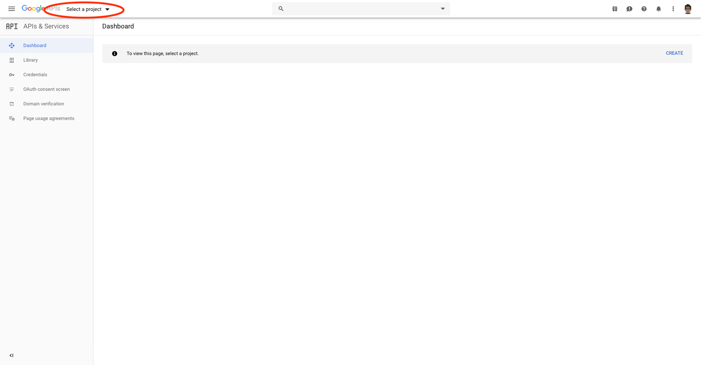
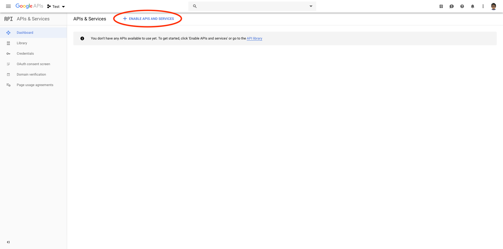
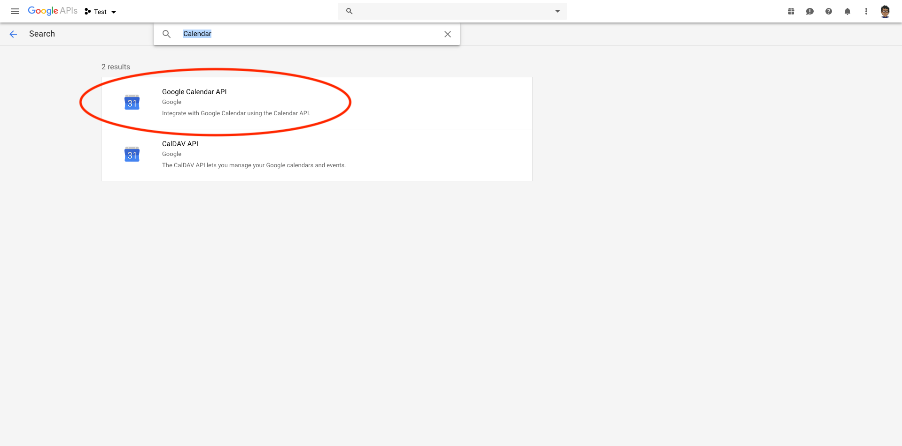
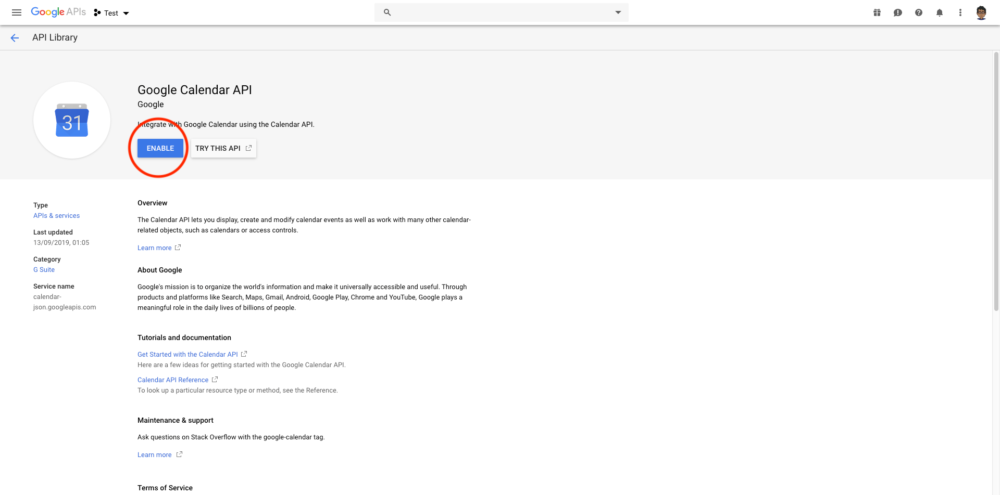
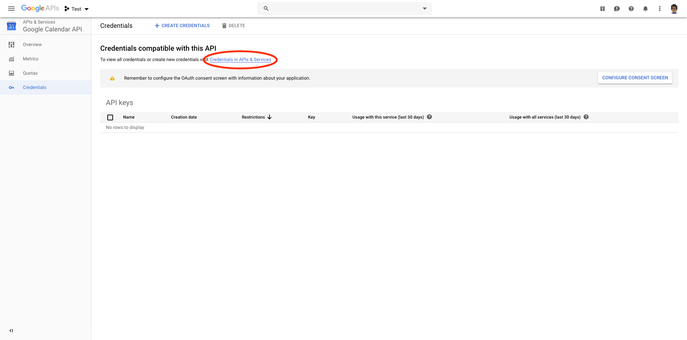
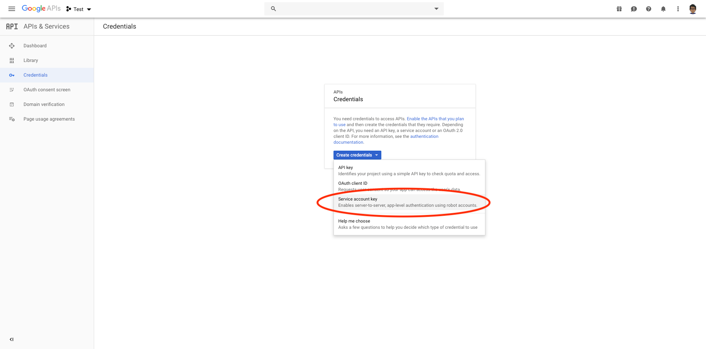
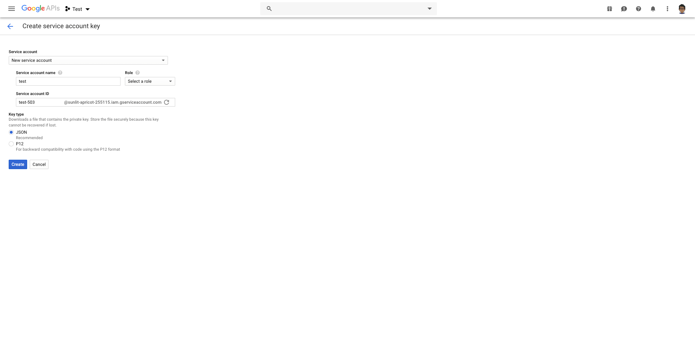
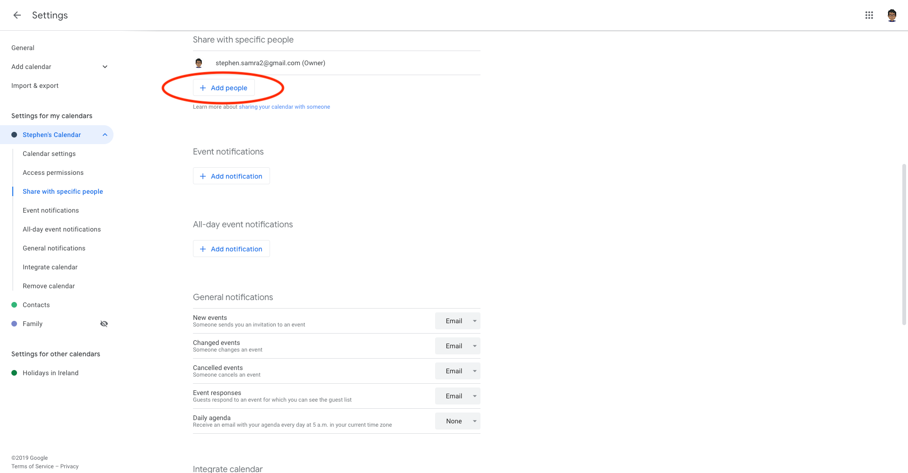
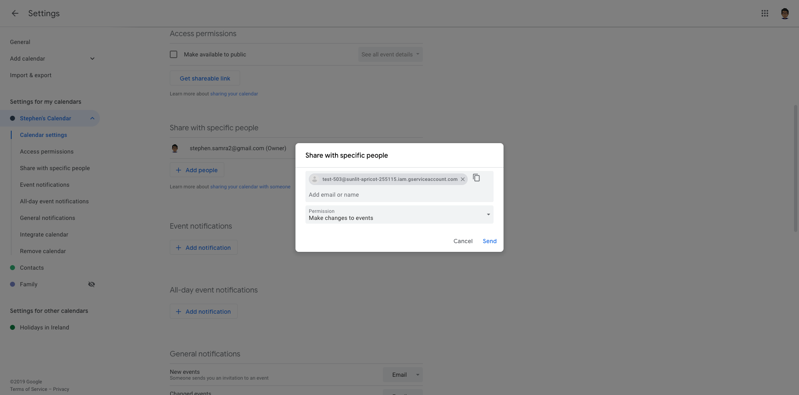
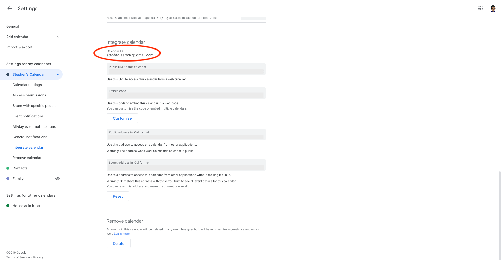

# Manage events on a Google Calendar

[](https://packagist.org/packages/spatie/laravel-google-calendar)
[](LICENSE.md)
[](https://packagist.org/packages/spatie/laravel-google-calendar)

This package makes working with a Google Calendar a breeze. Once it has been set up you can do these things:

```php
use Spatie\GoogleCalendar\Event;

// create a new event
$event = new Event;

$event->name = 'A new event';
$event->description = 'Event description';
$event->startDateTime = Carbon\Carbon::now();
$event->endDateTime = Carbon\Carbon::now()->addHour();
$event->addAttendee([
    'email' => 'john@example.com',
    'name' => 'John Doe',
    'comment' => 'Lorum ipsum',
    'responseStatus' => 'needsAction',
]);
$event->addAttendee(['email' => 'anotherEmail@gmail.com']);
$event->addMeetLink(); // optionally add a google meet link to the event

$event->save();

// get all future events on a calendar
$events = Event::get();

// update existing event
$firstEvent = $events->first();
$firstEvent->name = 'updated name';
$firstEvent->save();

$firstEvent->update(['name' => 'updated again']);

// create a new event
Event::create([
   'name' => 'A new event',
   'startDateTime' => Carbon\Carbon::now(),
   'endDateTime' => Carbon\Carbon::now()->addHour(),
]);

// delete an event
$event->delete();
```

Spatie is a webdesign agency based in Antwerp, Belgium. You'll find an overview of all our open source projects [on our website](https://spatie.be/opensource).

## Support us

[](https://spatie.be/github-ad-click/laravel-google-calendar)

We invest a lot of resources into creating [best in class open source packages](https://spatie.be/open-source). You can support us by [buying one of our paid products](https://spatie.be/open-source/support-us).

We highly appreciate you sending us a postcard from your hometown, mentioning which of our package(s) you are using. You'll find our address on [our contact page](https://spatie.be/about-us). We publish all received postcards on [our virtual postcard wall](https://spatie.be/open-source/postcards).

## Installation

You can install the package via composer:

```bash
composer require spatie/laravel-google-calendar
```

You must publish the configuration with this command:

```bash
php artisan vendor:publish --provider="Spatie\GoogleCalendar\GoogleCalendarServiceProvider"
```

This will publish a file called `google-calendar.php` in your config-directory with these contents:
```php
return [

    'default_auth_profile' => env('GOOGLE_CALENDAR_AUTH_PROFILE', 'service_account'),

    'auth_profiles' => [

        /*
         * Authenticate using a service account.
         */
        'service_account' => [
            /*
             * Path to the json file containing the credentials.
             */
            'credentials_json' => storage_path('app/google-calendar/service-account-credentials.json'),
        ],

        /*
         * Authenticate with actual google user account.
         */
        'oauth' => [
            /*
             * Path to the json file containing the oauth2 credentials.
             */
            'credentials_json' => storage_path('app/google-calendar/oauth-credentials.json'),

            /*
             * Path to the json file containing the oauth2 token.
             */
            'token_json' => storage_path('app/google-calendar/oauth-token.json'),
        ],
    ],

    /*
     * The id of the Google Calendar that will be used by default.
     */
    'calendar_id' => env('GOOGLE_CALENDAR_ID'),
];

```

## How to obtain the credentials to communicate with Google Calendar

The first thing you’ll need to do is get credentials to use Google's API. I’m assuming that you’ve already created a Google account and are signed in. Head over to [Google API console](https://console.developers.google.com/apis) and click "Select a project" in the header.



Next up we must specify which APIs the project may consume. From the header, select "Enable APIs and Services".



On the next page, search for "Calendar" and select "Google Calendar API" from the list.



From here, press "Enable" to enable the Google Calendar API for this project.



Now that you've created a project that has access to the Calendar API it's time to download a file with these credentials. Click "Credentials" in the sidebar and then press the "Credentials in APIs & Services" link.



From this page, open the "Create credentials" drop-down and select "Service account key".



On the next screen, you can give the service account a name. You can name it anything you’d like. In the service account id you’ll see an email address. We’ll use this email address later on in this guide. Select "JSON" as the key type and click "Create" to download the JSON file. You will get a warning that the service account does not have a role, you can safely ignore this and create the service account without assigning a role.

If you have delegated domain-wide access to the service account and you want to impersonate a user account, specify the email address of the user account in the config file.



Save the json inside your Laravel project at the location specified in the `service_account_credentials_json` key of the config file of this package. Because the json file contains potentially sensitive information, I don't recommend committing it to your git repository.

Now that everything is set up on the API site, we’ll need to configure some things on the Google Calendar site. Head over to Google Calendar and view the settings of the calendar you want to work with via PHP.  On the "Share with specific people" tab press the "Add people" button and add the service account id that was displayed when creating credentials on the API site.





Scroll down to the "Integrate calendar" section to see the id of the calendar. You need to specify that id in the config file.



### Authentication with OAuth2

This package supports OAuth2 authentication. This allows you to authenticate with an actual Google account, and to create and manage events with your own Google account.

OAuth2 authentication requires a token file, in addition to the credentials file. The easiest way to generate both of these files is by using the [php quickstart tool](https://developers.google.com/calendar/quickstart/php). Following this guide will generate two files, `credentials.json` and `token.json`. They must be saved to your project as `oauth-credentials.json` and `oauth-token.json`, respectively. Check the config file in this package for exact details on where to save these files.

To use OAuth2, you must also set a new environment variable in your .env file:

```php
GOOGLE_CALENDAR_AUTH_PROFILE=oauth
```

If you are upgrading from an older version of this package, you will need to force a publish of the configuration:

```bash
php artisan vendor:publish --provider="Spatie\GoogleCalendar\GoogleCalendarServiceProvider" --force
```

Finally, for a more seamless experience in your application, instead of using the quickstart tool you can set up a consent screen in the [Google API console](https://console.developers.google.com/apis). This would allow non-technical users of your application to easily generate their own tokens. This is completely optional.

## Usage

### Getting events

You can fetch all events by simply calling `Event::get();` this will return all events of the coming year. An event comes in the form of a `Spatie\GoogleCalendar\Event` object.

The full signature of the function is:

```php
public static function get(Carbon $startDateTime = null, Carbon $endDateTime = null, array $queryParameters = [], string $calendarId = null): Collection
```

The parameters you can pass in `$queryParameters` are listed [on the documentation on `list` at the Google Calendar API docs](https://developers.google.com/google-apps/calendar/v3/reference/events/list#request).

### Accessing start and end dates of an event

You can use these getters to retrieve start and end date as [Carbon](https://github.com/briannesbitt/Carbon) instances:

```php
$events = Event::get();

$events[0]->startDate;
$events[0]->startDateTime;
$events[0]->endDate;
$events[0]->endDateTime;
```

### Creating an event

You can just new up a `Spatie\GoogleCalendar\Event`-object

```php
$event = new Event;

$event->name = 'A new event';
$event->startDateTime = Carbon\Carbon::now();
$event->endDateTime = Carbon\Carbon::now()->addHour();

$event->save();
```

You can also call `create` statically:

```php
Event::create([
   'name' => 'A new event',
   'startDateTime' => Carbon\Carbon::now(),
   'endDateTime' => Carbon\Carbon::now()->addHour(),
]);
```

This will create an event with a specific start and end time. If you want to create a full-day event you must use `startDate` and `endDate` instead of `startDateTime` and `endDateTime`.

```php
$event = new Event;

$event->name = 'A new full day event';
$event->startDate = Carbon\Carbon::now();
$event->endDate = Carbon\Carbon::now()->addDay();

$event->save();
```

You can create an event based on a simple text string like this:

```php
$event = new Event();

$event->quickSave('Appointment at Somewhere on April 25 10am-10:25am');

// statically
Event::quickCreate('Appointment at Somewhere on April 25 10am-10:25am');
```

### Getting a single event

Google assigns a unique id to every single event. You can get this id by getting events using the `get` method and getting the `id` property on a `Spatie\GoogleCalendar\Event`-object:
```php
// get the id of the first upcoming event in the calendar.
$eventId = Event::get()->first()->id;

// you can also get the id after creating the event, then you can save it to database.
$event = new Event;
$newEvent = $event->save();
echo $newEvent->id; // display the event id
```

You can use this id to fetch a single event from Google:
```php
Event::find($eventId);
```

### Updating an event

Easy, just change some properties and call `save()`:

```php
$event = Event::find($eventId);

$event->name = 'My updated title';
$event->save();
```

Alternatively, you can use the update method:

```php
$event = Event::find($eventId);

$event->update(['name' => 'My updated title']);
```

### Deleting an event

Nothing to it!

```php
$event = Event::find($eventId);

$event->delete();
```

## Setting a source

You can set source urls in your events, which are only visible to the creator of the event (see [docs](https://developers.google.com/calendar/v3/reference/events) for more on the source property). This function only works when authenticated via OAuth.

```php
$yourEvent->source = [
   'title' => 'Test Source Title',
   'url' => 'http://testsource.url',
];
```

## Setting a color

You can set certain colors for your events (colorId 1 to 11). The possibilities are limited to the color definitions of the Google Calendar API. You can find them [here](https://developers.google.com/calendar/api/v3/reference/colors/get).

```php
$yourevent->setColorId(11);
```

### Limitations

The Google Calendar API provides many options. This package doesn't support all of them. For instance, recurring events cannot be managed properly with this package. If you stick to creating events with a name and a date you should be fine.

## Upgrading from v1 to v2

The only major difference between `v1` and `v2` is that under the hood Google API v2 is used instead of v1. Here are the steps required to upgrade:
 - rename the config file from `laravel-google-calendar` to `google-calendar`
 - in the config file rename the `client_secret_json` key to `service_account_credentials_json`

## Changelog

Please see [CHANGELOG](CHANGELOG.md) for more information about what has changed recently.

## Testing

``` bash
composer test
```

## Contributing

Please see [CONTRIBUTING](https://github.com/spatie/.github/blob/main/CONTRIBUTING.md) for details.

## Security

If you discover any security-related issues, please email freek@spatie.be instead of using the issue tracker.

## Credits

- [Freek Van der Herten](https://github.com/freekmurze)
- [All Contributors](../../contributors)

A big thank you to [Sebastiaan Luca](https://github.com/sebastiaanluca) for his big help creating v2 of this package.

## License

The MIT License (MIT). Please see [License File](LICENSE.md) for more information.
